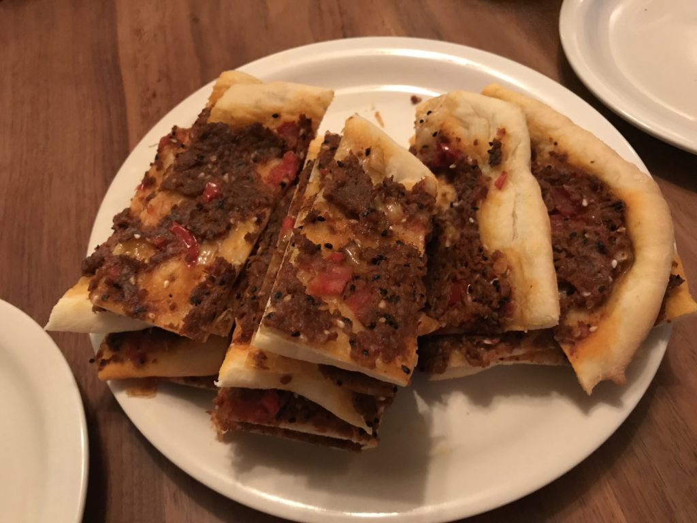
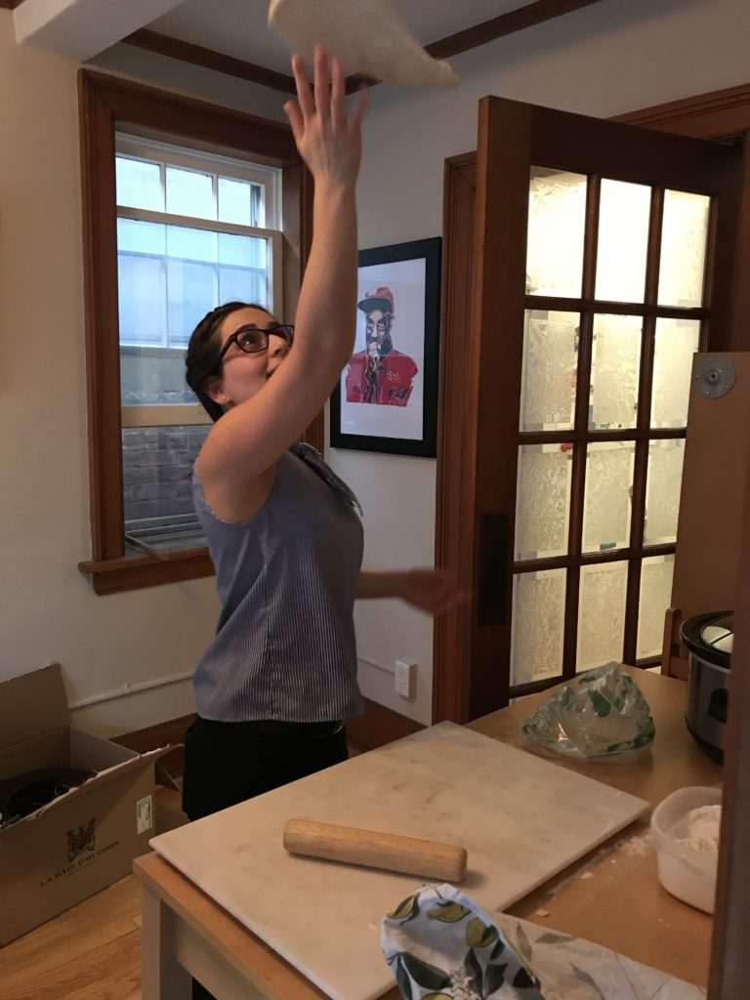
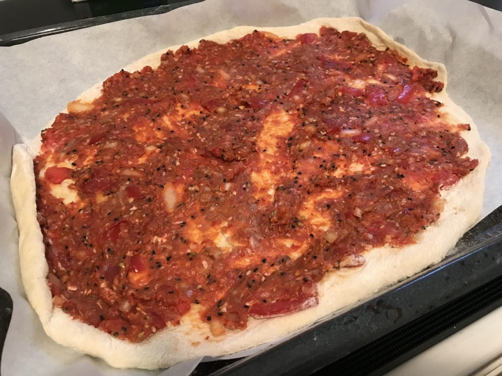
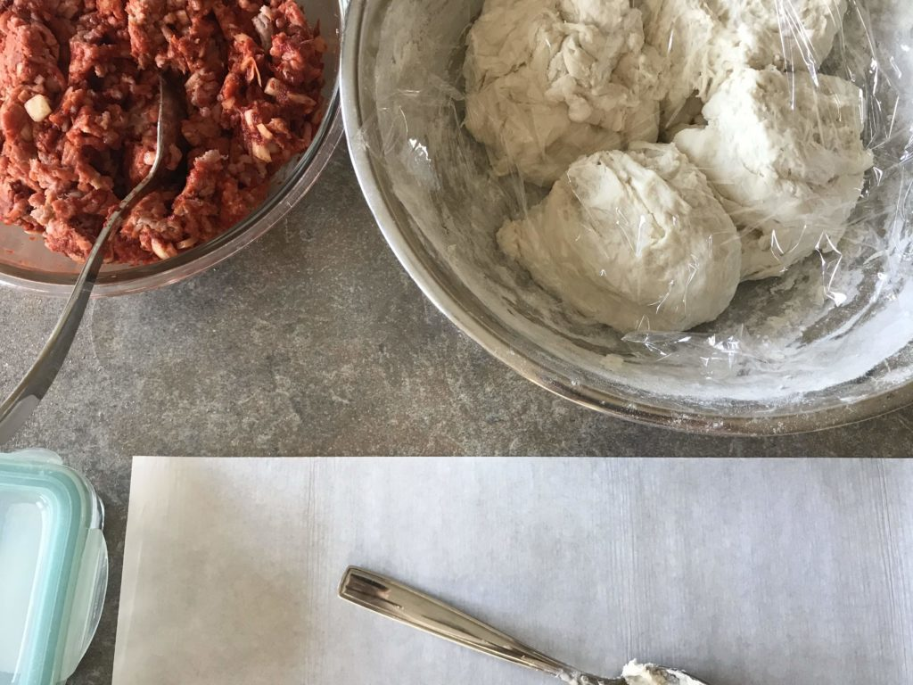

# Ingredients

(double to make 3 half-try )

- 2 ½ cups flour plus 2 more tablespoons
- 1 tablespoon sugar
- 1 tablespoon instant yeast
- 1 cup warm water
- ¼ cup olive oil
- 1 teaspoon salt

# Instructions

- Start by mixing the yeast in the 1 cup of warm water. Make sure it's not hot water or the yeast will not activate. Set aside for 3 minutes.
- In a bowl, add 1 cup of the flour along with the sugar and the yeast and water mixture. Mix well with a spoon, cover with plastic wrap and set aside for 10 minutes.
- After 10 minutes, add the rest of the flour (1 ½ cups plus 2 tablespoons), ¼ cup olive oil and the salt and mix well until a shaggy dough forms.
- Using your hands, knead the dough for 3-4 minutes, then smooth it out and set aside to rise for about 30 minutes, covered.
- Preheat your oven to 375F while the dough rises
- Spread and top the dough on baking sheets
- Place the baking sheets in the oven on the bottom rack and bake for 12-15 minutes until the bottom is lightly golden. You can bake more than one sheet at one time, by placing one on the bottom rack and one on the middle rack. Once the bottom rack manakish are cooked, then switch the middle rack sheet pan to the bottom for a few more minutes until cooked through

- 

- 

- 

- 

Source: [HungryPaprikas](https://www.hungrypaprikas.com/manakish/)
