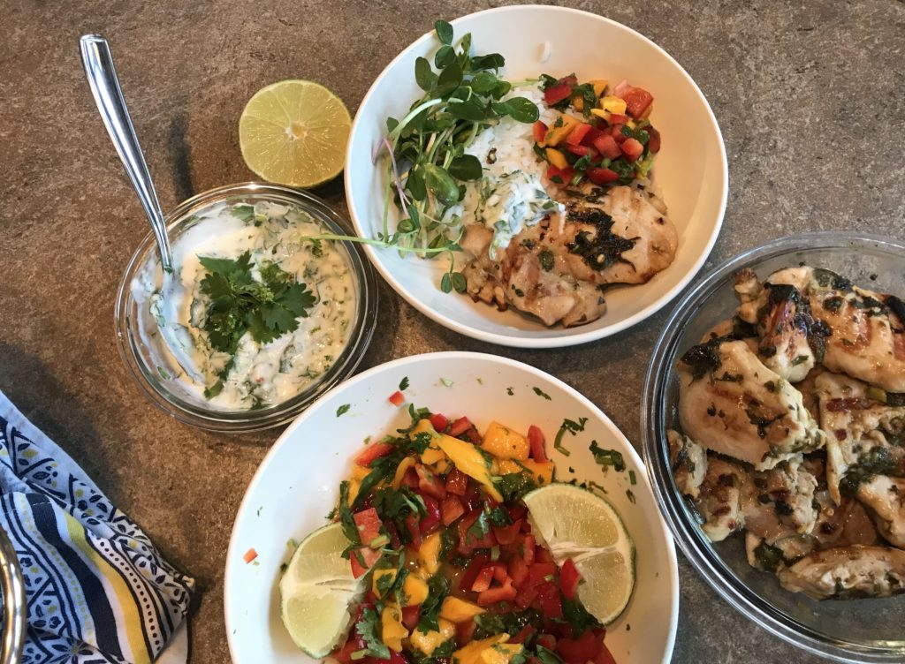
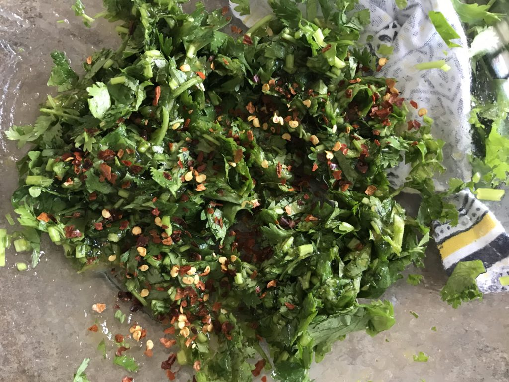

## Ingredients

- 1-2 tbsp olive oil
- 2-4 tbsp Rootham's Niagara Peach Ghost Pepper Sauce (it's mild, don't worry)
- Generous handful of chopped cilantro
- Salt
- 1 lime (zest + juice)
- Red pepper flakes

- 
    
    Cilantro lime chicken with mango salsa and Mexican crema sauce
    
- 
