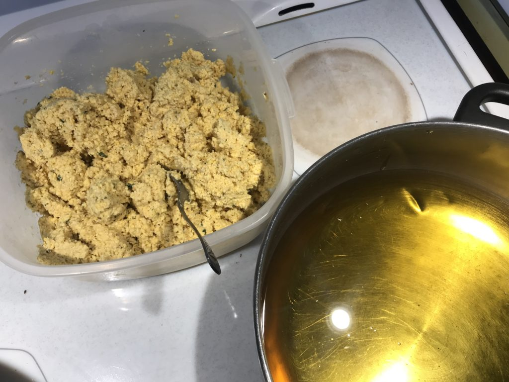
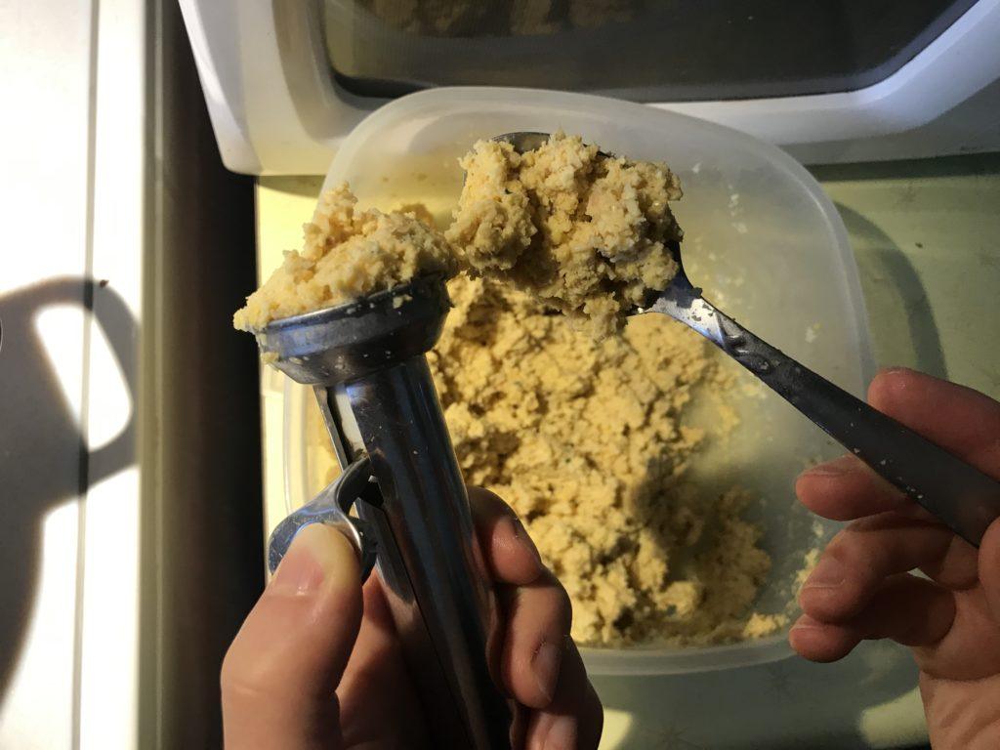
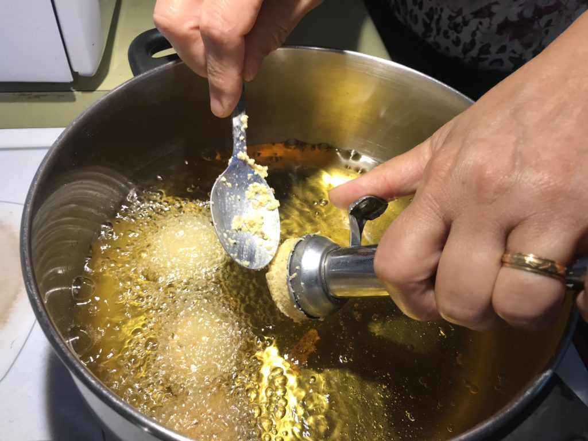
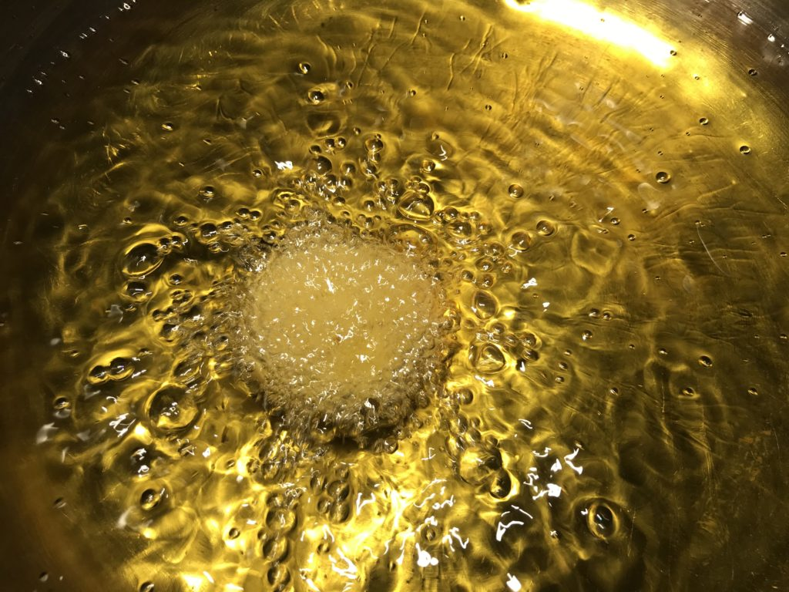
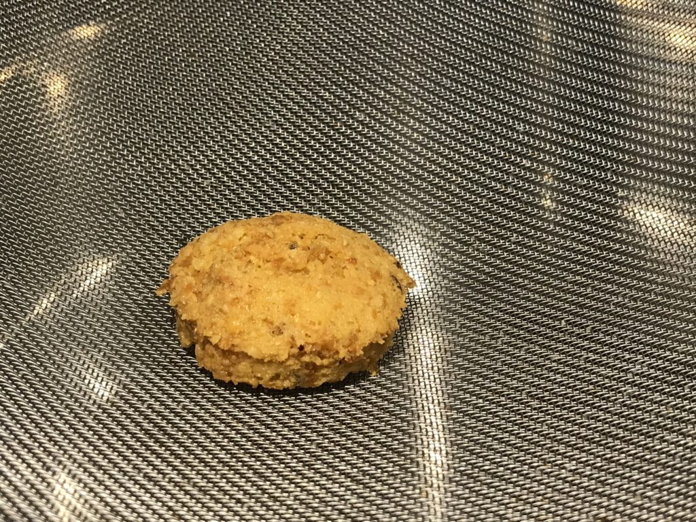
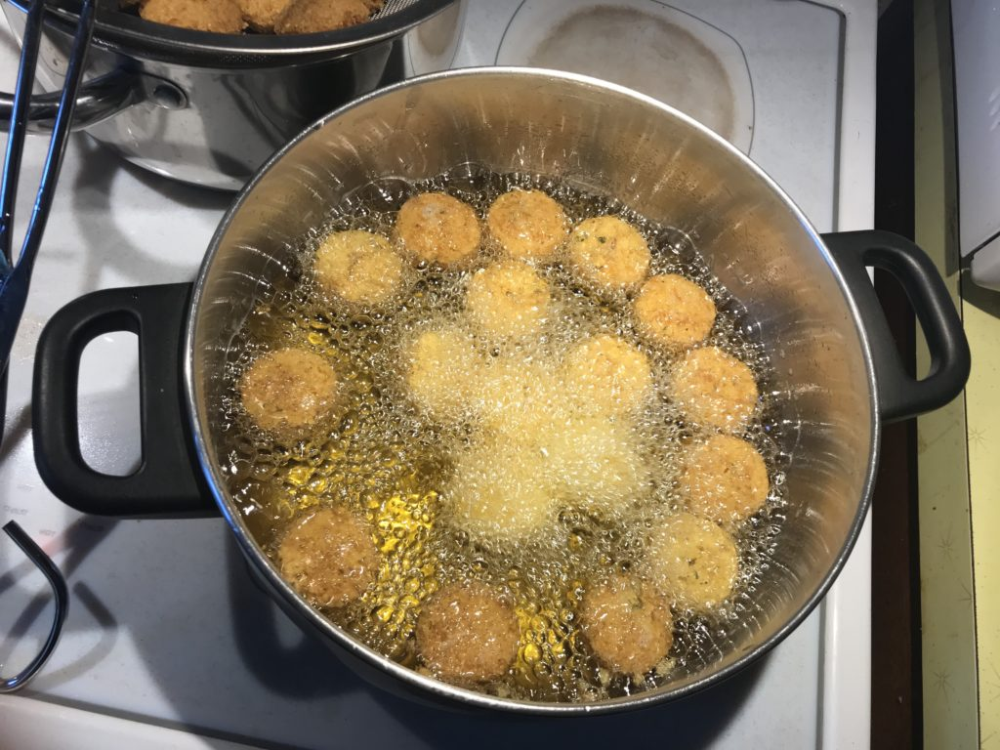

## Ingredients

- 4 cups ground chick peas
- Salt
- 1 tbsp mint
- 1 tsp baking soda
- 1-2 tbsp lemon juice
- 4-8 cups corn oil

## Steps

- Mix ground chick peas, salt, mint in bowl
- Put baking soda in one corner of chickpeas bowl
- Add lemon juice over baking soda to cause a foaming reaction. Mix into the chickpeas as it foams.
- Heat corn oil in pot on medium high heat until hot and ready for deep frying
    - If oil starts smoking, it is burning and won't be good! Let it cool or try again with new oil.
- Scoop into the hot oil 1.5 inch discs with an indent/hole poked in the middle (with the back of a spoon) for even cooking throughout
- Flip and wait until they float to the top of the oil
- Scoop out and air dry in a strainer
- Serve in a pita with tomatoes, lettuce, parsley, pickled radishes, and sauce (tahini, yoghurt, lemon)

- 
    
- 
    
- 
    
- 
    
- 
    
- 
    

## History

Learned to make this from my mother-in-law, Taghrid! – Andrew
