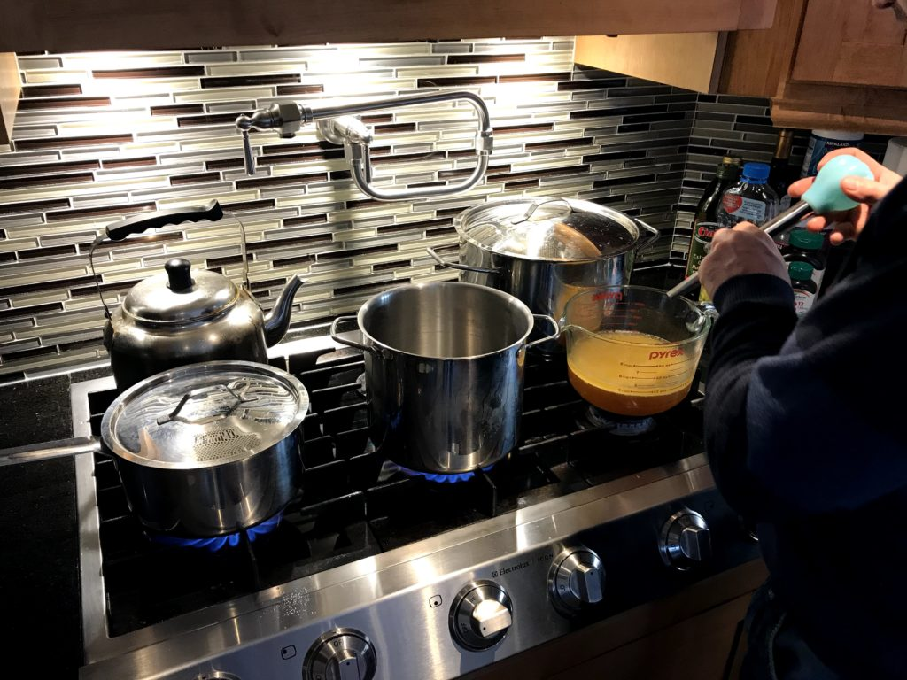
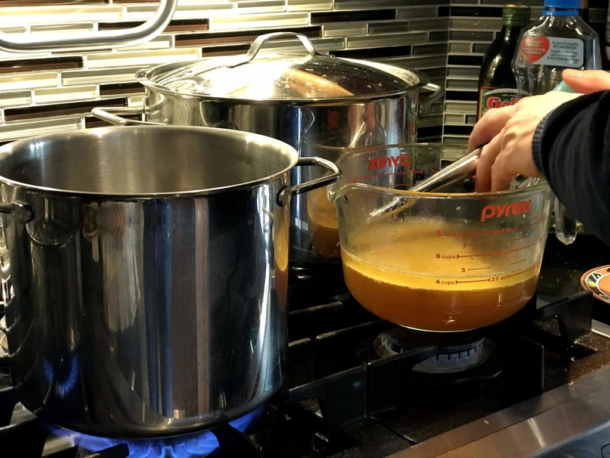
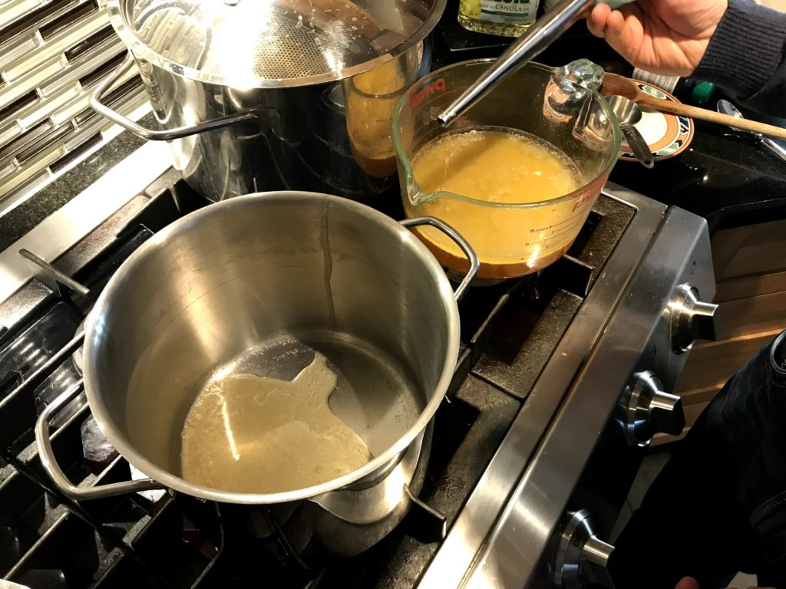
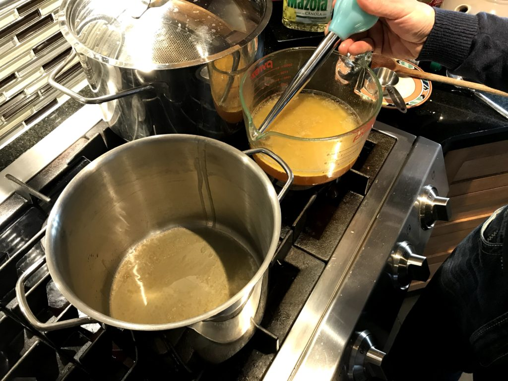
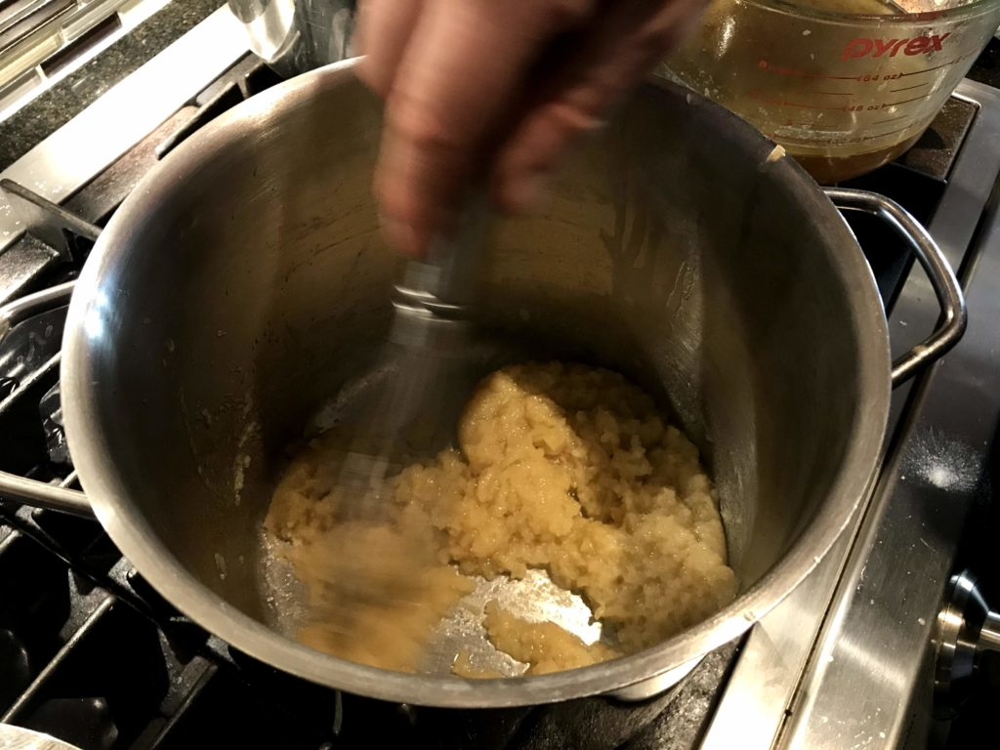
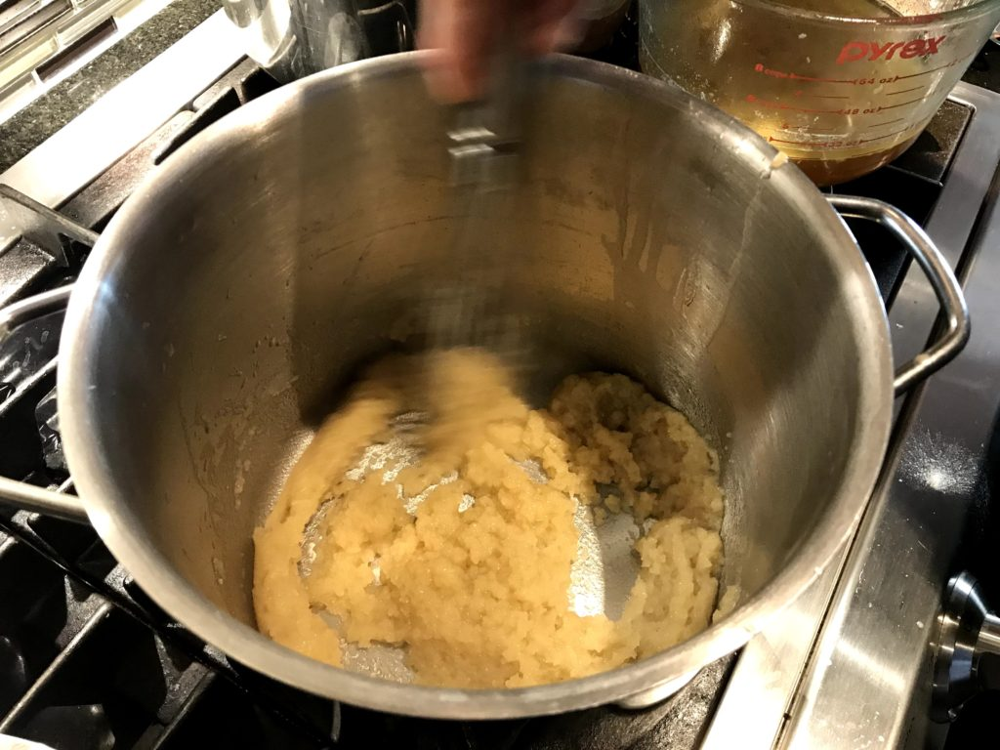
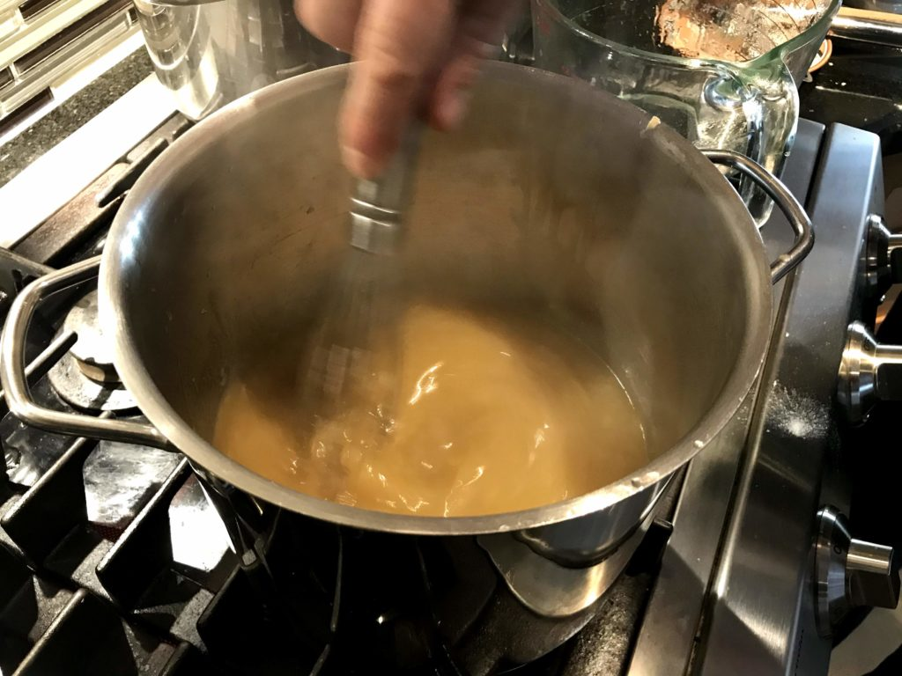
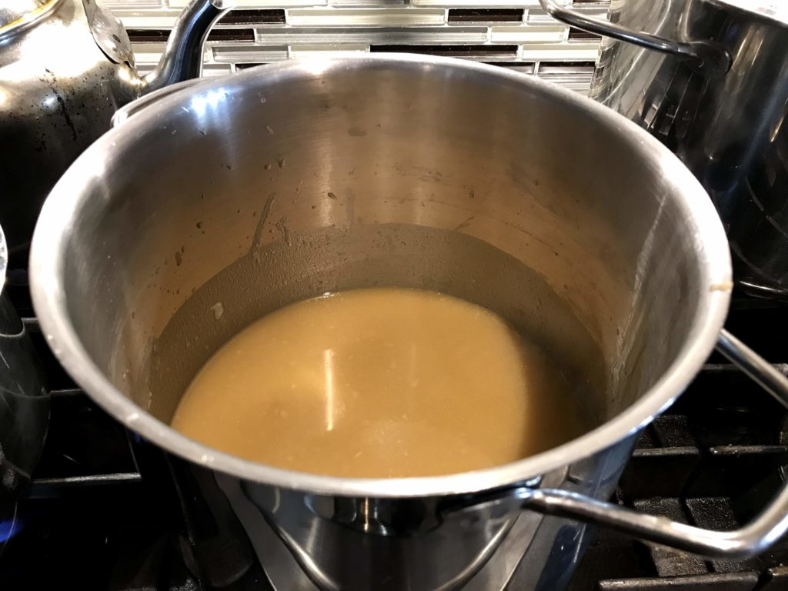
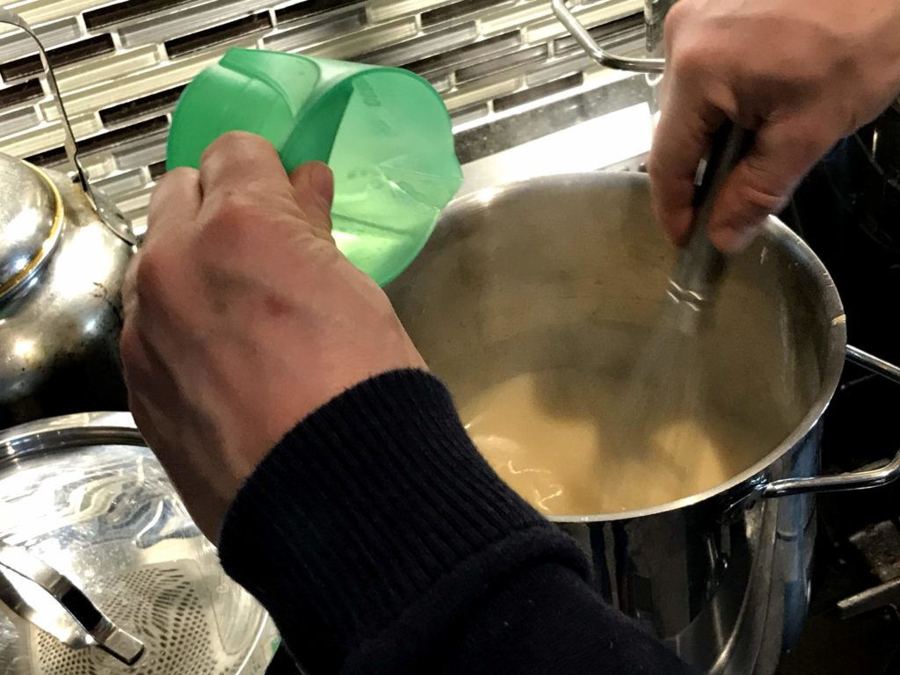

## Steps

- Allow drippings to sit and separate
- Heat pot on medium
- Use a turkey baster to put only the fat (top layer) in the pot
- Let fat heat up and add a bit of flour until it becomes a paste
- Add rest of fat and drippings. Alternatively add starch water from boiled potatoes if present.
- Turn heat down a bit and mix
- Optionally, preheat some cream (1/4 cup, 35%) to add for creaminess. Make sure it's preheated so there is no temperate shock in either direction or risk of curdling when added.

- 
    
- 
    
- 
    
- 
    
- 
    
- 
    
- 
    
- 
    
- 
