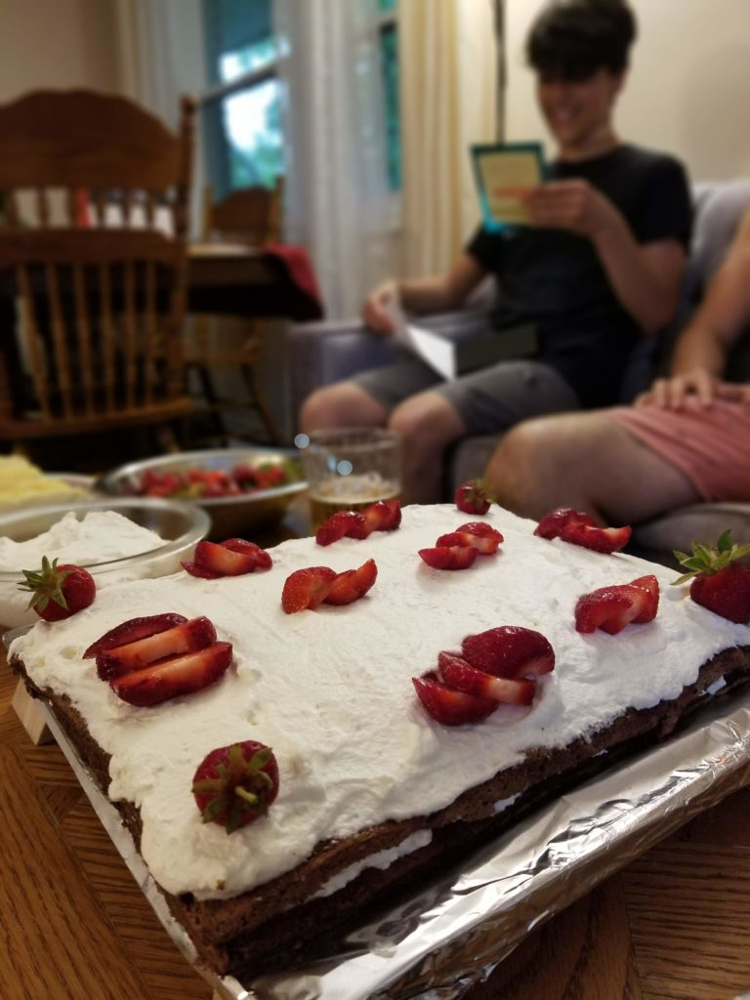
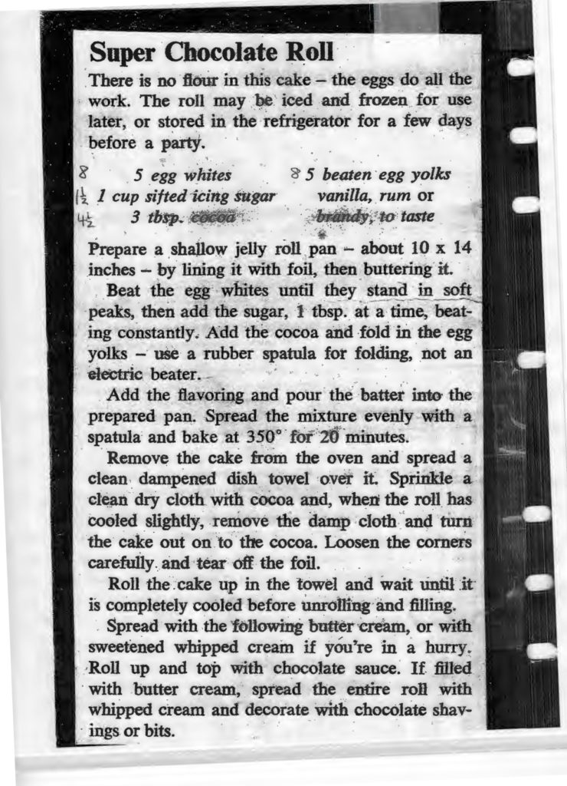

A multi-decade Paradi family favourite, especially around birthdays; Grandma's Chocolate Roll (with optional sour cherry pie filling)!

There is no flour in this cake – the eggs do all the work. The roll may be iced and frozen for use later, or stored in the refrigerator for a few days before a party.

## Ingredients

In (brackets) is the recipe multiplied by 1.5, which is a family shareable amount.

- 5 egg whites (8)
- 1 cup sifted icing sugar (1 1/2)
- 3 tbsp cocoa (4 1/2)
- 5 beaten egg yolks (8)
- Vanilla, rum, or brandy to taste

## Steps

- Prepare a shallow jelly roll pan – about 10" x 14" – by lining it with foil, then buttering it
- Beat the egg whites until they stand in soft peaks, then add the sugar, 1tbsp at a time, beating constantly.
- Add the cocoa and fold in the egg yolks – use a rubber spatula for folding, not an electric beater
- Add the flavoring and pour the batter into the prepared pan. Spread the mixture evenly with a spatula and bake at 350º F for 20 minutes
- Remove the cake form the oven and spread a clean dampened dish towel over it. Sprinkle a clean dry cloth with cocoa and, when the roll has cooled slightly, remove the damp cloth and turn the cake out on to the cocoa. Loosen the corners carefully and tear off the foil
- Roll the cake up in the towel and wait until it is completely cooled before unrolling and filling
    - Alternatively, cut the cake in two and stack it to make a layered cake as pictured
- Spread with the following butter cream, or with sweetened whipped cream if you're in a hurry.
- Topping from Paradi house: Serve with bowl of cherry pie filling on the side so all who desire can dollop large quantities onto their plate to eat with a thick slice of chocolate roll
- Topping from Original Recipe: Roll up and top with chocolate sauce. If filled with butter cream, spread the entire roll with whipped cream and decorate with chocolate shavings or bits

